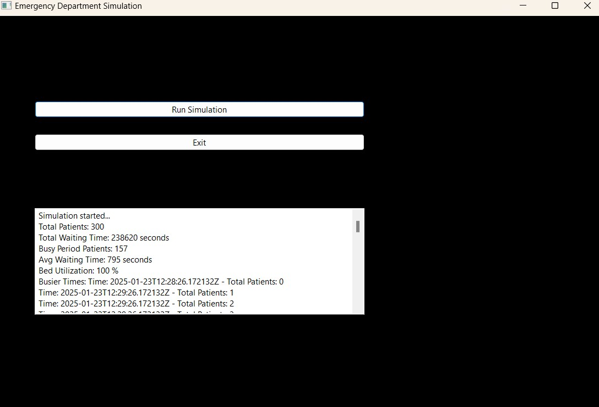
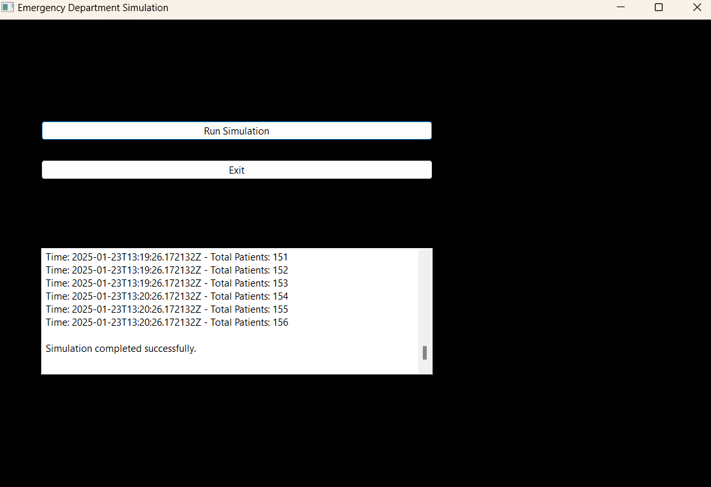
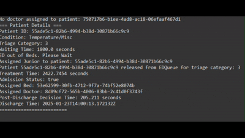

# Emergency Department Simulation

This project simulates the functioning of a hospital Emergency Department (ED), focusing on resource allocation, patient flow management, and performance statistics using object-oriented programming principles.

---

## Features

- **Triage System**: Categorizes patients based on severity using Emergency Severity Index(Static/Emergency Severity Index Handbook.pdf) standards.
- **Probability Distributions**:
  - Interarrival time: Weibull Distribution.
  - Treatment time: Pearson VI Distribution.
  - Post-Discharge Decision Time (PDDT): Exponential Distribution.
- **Resource Allocation**:
  - Doctors: Interns, Junior Residents, Senior Residents, Registrars, and Consultants.
  - Beds: Resuscitation, Acute, Sub-acute, Corridor Stretchers, and Recliners.
- **Dynamic Simulation**: Real-time generation and management of patients using multi-threading.
- **Statistics & Reporting**:
  - Average waiting time.
  - Bed utilization.
  - Busy periods.
  - Exported reports in CSV format.
- **Graphical User Interface (GUI)**: User-friendly interface to run simulations and view results.

---

## Installation

1. **Prerequisites**:
   - Java Development Kit (JDK) 17 or higher.
   - SWT library for GUI development.
   - A text editor or IDE (e.g., Eclipse, IntelliJ IDEA).

2. **Setup**:
   - Clone or download this repository.
   - Import the project into your IDE.
   - Add the SWT library to your project build path.

---

## Usage

1. Launch the application by running the `GUI` class.
2. Use the **Run Simulation** button to start the simulation.
3. View simulation progress and results in the console or GUI text area.
4. Use the **Exit** button to close the application.

---

## Code Highlights

- **Object-Oriented Design**:
  - Abstract classes (`Resources`, `EDQueue`) for reusability.
  - Concrete classes (`Patient`, `Doctor`, `Bed`, `EDQ1`-`EDQ5`) for specific implementations.
- **Custom Simulation Clock**:
  - Synchronizes real-world and simulated time for event handling.
- **Multi-Threading**:
  - Separate threads for patient generation and file processing for efficient execution.

---

## Output

The application provides the following outputs:
1. Console log with real-time updates on patient arrivals, resource allocations, and departures.
2. GUI text area displaying summary statistics, such as:
   - Total patients.
   - Average waiting time.
   - Bed utilization.
   - Busy periods.

---

## Results Screenshots

### GUI Output

  

  

### Console in Action

  

---

## Authors

- **Muhammad Hisham Bin Nauman**
- **Rohan Arshad**
- **Talha Anwar Saeed Qureshi**

---

